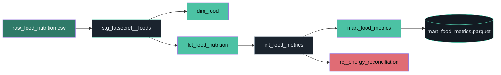

# FatSecret Governed Semantic Layer — Project Document

_A living document of what this project is, why it's built this way, and where it stands._

---

## 1. The thesis

**The LLM never touches the data.**

A natural-language nutrition data product where a language model chooses *which pre-defined,
governed metric* answers a question — and nothing more. It never writes SQL, never sees raw
tables, and never invents an identifier. Deterministic code resolves the food and runs a
versioned, parameter-bound query. Every answer shows its provenance. If no defined metric fits,
the system **refuses** rather than guessing.

Built as a portfolio piece for a **FatSecret job application**: evidence of judgment about AI
agents + a governed semantic layer at industry standard. The discipline — three metrics done
with tests, lineage, definitions, and a graceful refusal — is the argument, not feature count.

## 2. The three metrics (fixed — no expansion)

| Metric | Definition |
|---|---|
| `calories_per_100g` | Stated food energy in kcal per 100 g |
| `macro_split` | Each macro's Atwater energy (P 4, C 4, F 9 kcal/g) as % of total macro energy; sums to 100 |
| `protein_density` | `protein_g_per_100g / energy_kcal_per_100g * 100` (g protein per 100 kcal) |

## 3. Architecture

```
FatSecret API → ingest (land_raw.py) → raw CSV seed
                                          → dbt: staging → marts (+ tests + docs + lineage)
                                            → freeze → app/data/mart_food_metrics.parquet
                                              → metric registry (name, definition, SQL, filters, owner)
                                                → LLM (OpenAI or Anthropic): question → metric name + food STRING only
                                                  → deterministic resolver: food string → food_id (candidates)
                                                    → executor: parameter-bound governed query
                                                      → answer + full provenance (metric, definition, SQL, rows)
```

**The non-negotiable boundary:** the LLM returns `{ metric, food_query }` — a registry-enum
metric name and a food *string*. It never emits SQL and never emits an id. Application code maps
that to a governed query. Injection is inert: a non-integer `food_id` is rejected at the DuckDB
binder *and* at the API schema.

### dbt lineage (generated model DAG)



Run `dbt docs serve --profiles-dir .` (from `pipeline/dbt`) for the interactive graph, column
docs, and test results — the screenshot-worthy governance artifact.

## 4. Repository map

```
fatsecret-semantic-layer/
├─ README.md                     Thesis-first overview + run instructions
├─ docs/PROJECT.md               This document
├─ .gitignore / .gitattributes   Secrets & raw pulls excluded; parquet marked binary
│
├─ app/                          Next.js 16 + React 19 + TypeScript (deploys to Vercel)
│  ├─ semantic/                  ← the governed semantic layer (the heart)
│  │  ├─ registry.yaml           THE governance contract: 3 metrics, definitions, owners, filters
│  │  ├─ registry.ts             Loads + zod-validates the registry; exposes the LLM-visible slice
│  │  ├─ types.ts                Zod schemas + TS types (MetricDef, ExecutionResult, …)
│  │  ├─ sql/*.sql               Governed, parameter-bound queries (one per metric)
│  │  ├─ warehouse.ts            DuckDB singleton over the frozen Parquet; BigInt/Decimal coercion
│  │  ├─ executor.ts             Validates params, runs the bound query, returns provenance
│  │  ├─ resolver.ts             Deterministic fuzzy food-string → candidate ids
│  │  ├─ llm.ts                  Provider-agnostic (OpenAI default / Anthropic); enum generated from registry
│  │  ├─ ask.ts                  Pipeline: answered | refused | needs_disambiguation | food_not_found
│  │  └─ codegen.ts              CI integrity gate; prints the LLM's generated metric enum
│  ├─ app/                       Next App Router: page.tsx (UI + provenance panel), api/ask/route.ts
│  ├─ data/                      Frozen mart (mart_food_metrics.parquet) — the deployed data
│  ├─ tests/                     Vitest unit (fixture-pinned) + tests/integration (real mart) — 29 tests
│  └─ evals/                     questions.jsonl + eval.test.ts (live constraint proof; needs an LLM key)
│
└─ pipeline/                     Python ingest + dbt (runs offline / in CI, not on Vercel)
   ├─ ingest/                    fatsecret_client.py (OAuth2), land_raw.py, ingest_manifest.csv (provenance)
   ├─ dbt/                       dbt project (DuckDB + Snowflake targets)
   │  ├─ seeds/raw_food_nutrition.csv   Curated raw slice (offline source of truth)
   │  ├─ models/staging/         stg_fatsecret__foods (+ schema docs & tests)
   │  ├─ models/marts/           dim_food, fct_food_nutrition, mart_food_metrics
   │  │  ├─ intermediate/        int_food_metrics (metrics + reconciliation)
   │  │  └─ rejects/             rej_energy_reconciliation (quarantine)
   │  └─ tests/                  assert_macros_reconcile.sql (the reconciliation test)
   └─ freeze/export_parquet.py   dbt mart → app/data/*.parquet
```

## 5. Key design decisions (and why)

- **LLM emits a food string, never an id.** Emitting an id would be hallucinating a key — the
  exact failure the thesis condemns. Resolution is deterministic and explainable; ambiguous
  matches are shown to the user to pick (never auto-guessed).
- **Metric enum generated from the registry.** The tool schema's `enum` is built from
  `registry.yaml`, so the model *cannot* name a metric that doesn't exist. Re-validated in code
  (defence in depth).
- **Governed SQL is parameter-bound, never interpolated.** The registry references versioned
  `.sql` files with a single `food_id` bind. Provenance is the executor's return type.
- **Warehouse = Both.** dbt on Snowflake (resume signal) + frozen DuckDB/Parquet (reproducible,
  free, zero live dependency during the interview). One codebase, two profile targets.
- **`macro_split` = % of Atwater macro energy (sums to 100).** Kept separate from the
  reconciliation check, which independently verifies Atwater-vs-stated agreement.
- **Reconciliation tolerance = `max(±10 kcal, ±10%)`.** Real food data doesn't reconcile
  exactly (fibre, rounding). Failing rows are quarantined into a rejects model, not trusted; a
  `warn`-severity test surfaces the count.
- **Registry hand-rolled (not dbt MetricFlow).** For a 4-minute demo you want to *show the file*.
- **TypeScript pinned to 5.9** (TS 7 is latest) and **Next 16** for ecosystem stability.

## 6. How to run

**App (deterministic core — no API key):**
```bash
cd app && npm install
npm test            # 29 tests: registry, resolver, executor, LLM-boundary, + live-mart integration
npm run codegen     # governance integrity gate (prints the metric enum)
```

**App (full loop — needs an LLM key in app/.env.local: OPENAI_API_KEY by default, or ANTHROPIC_API_KEY):**
```bash
npm run dev         # http://localhost:3000
npm run eval        # 10-case live constraint proof (6 selections + 4 refusals)
```

**Pipeline (dbt on DuckDB — no credentials). See pipeline/README.md for the exact Python path:**
```bash
cd pipeline && python -m venv .venv && .venv/Scripts/pip install -r requirements.txt
cd dbt && dbt deps --profiles-dir . && dbt build --profiles-dir . && dbt docs generate --profiles-dir .
cd .. && .venv/Scripts/python freeze/export_parquet.py
```

## 7. Status (2026-07-21)

- **Phase 0 — walking skeleton: COMPLETE.** End-to-end thesis; 29 tests pass; production build
  passes; UI + provenance panel verified.
- **Phase 1 — ingest: COMPLETE.** FatSecret OAuth2 client + landing/normalization run live; pulled
  a ~20-food slice (recorded in `ingest/ingest_manifest.csv`). A per-food gram-serving normaliser
  and a "prefer Generic" selector keep the slice clean; a governance gate refuses to overwrite the
  seed on a short pull.
- **Phase 2 — dbt: COMPLETE (DuckDB).** `dbt build` = 44 PASS / 0 WARN / 0 ERROR on 20 foods
  pulled from the FatSecret API. Every food reconciles within tolerance, so the quarantine
  (`rej_energy_reconciliation`) is currently empty; the reconciliation test still runs and would
  flag any food whose macros don't reconcile. Docs/lineage generated; mart frozen to the app
  Parquet; each pull is recorded in a committed `ingest_manifest.csv` (search term, selected id,
  timestamp, raw-response SHA-256).
  Snowflake target configured (same models), not yet run.
- **Phase 3 — semantic layer: COMPLETE** (Phase 0). **Phase 4 — LLM boundary: COMPLETE** — live
  eval passes 10/10 against OpenAI `gpt-4.1-mini`. **Phase 5 — UI: COMPLETE.**
- **Phase 6 — ship to Vercel: COMPLETE & LIVE.** https://app-theta-roan-41.vercel.app — native
  DuckDB + frozen Parquet verified working in serverless; full loop (OpenAI selection → governed
  query → provenance) and graceful refusal verified live in production. Env: `LLM_PROVIDER`,
  `OPENAI_MODEL`, `OPENAI_API_KEY` set in Vercel. Deployed via `vercel deploy --prod` (remote build
  installs the linux-x64 DuckDB binding); `next.config` uses `outputFileTracingIncludes` to ship
  the Parquet + native addon into the `/api/ask` function.

## 8. Open items

- Make the pretty domain (`fatsecret-semantic-layer.vercel.app`) public: toggle off Vercel
  Deployment Protection in project settings (the working public URL is the alias above).
- Snowflake target: `pip install dbt-snowflake` + set `SF_*` env, then `dbt build --target snowflake`.
  The models are portable; the DuckDB path is already the source of truth.
- Optional: refine two search terms so the whole slice is FatSecret "Generic" (currently a couple
  resolve to "Brand" entries — see `ingest_manifest.csv`).

## 9. Legal

Independent demo built on the public FatSecret Platform API. Not affiliated with or endorsed by
FatSecret. No branding/logo used. Only a small slice (~20 foods) pulled from the API is cached —
mostly FatSecret "Generic" entries, a couple "Brand". Raw JSON responses are gitignored and never
redistributed; `ingest/ingest_manifest.csv` records the pull (term, selected id, timestamp, and the
SHA-256 of each raw response) without publishing the raw content.
